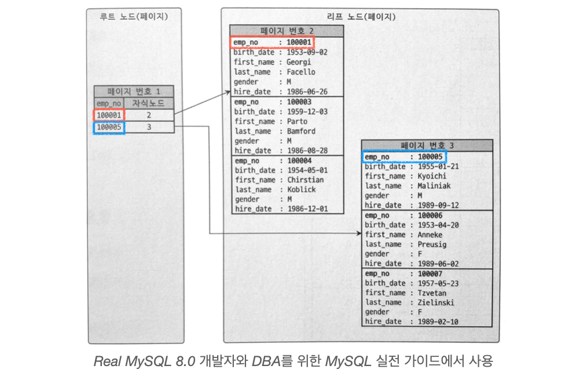

# Index (MariaDB 기준)

## Index 란?

데이터의 저장(INSERT, UPDATE, DELETE) 성능을 희생하고 그 대신 데이터의 읽기 속도를 높이는 기능이다.

데이터의 추가나 삭제 시 인덱스 또한 재정렬 과정을 거쳐야하므로 INSERT, UPDATE, DELETE 와  
같은 데이터 저장 성능은 떨어질 수밖에 없다.

## 인덱스의 역할별 구분

### Primary key (Clustered Index, 기본키)

- 레코드를 대표하는 칼럼의 값으로 만들어진 인덱스다. NULL 값과 중복을 허용하지 않는다.
- Unique + Not Null + 클러스터드 인덱스 역할

클러스터링이란 여러 개를 하나로 묶는다는 의미로 사용한다.   
클러스터드 인덱스는 테이블의 PK에 대해서만 적용된다.   
즉, PK 값이 비슷한 레코드끼리 묶어서 저장하는 것을 **클러스터드 인덱스**라고 표현한다.

PK 값에 의해 레코드의 위치가 결정되며 이는 PK 변경 시 레코드의 물리적인 저장 위치를 변경해야한다는 의미이다.  
따라서 인덱스 알고리즘이라기 보단 테이블 레코드의 저장방식이라고 볼 수 있다.

InnoDB 와 같이 항상 클러스터드 인덱스로 저장되는 테이블은 PK 기반 검색이 매우 빠르며  
대신 레코드의 저장이나 PK 변경이 상대적으로 느리다.

> B-Tree 도 인덱스 값으로 정렬되어있으므로 인덱스로 클러스터링되었다고 생각할 수 있지만  
> 이는 클러스터링 인덱스라고 하지 않는다.   
> 테이블의 레코드가 PK 값으로 정렬된 경우만 클러스터링 인덱스 또는 클러스터링 테이블이라고 한다.

> Clustered Index 는 InnoDB 스토리지 엔진에서만 생성된다.

위 구조는 클러스터링 테이블의 구조이며 B-Tree 와 비슷하다.   
Secondary Index 를 위한 B-Tree 의 리프 노드에는 RowID(InnoDB 기준 PK)가 저장되어있지만  
클러스터링 인덱스의 리프 노드에는 레코드의 모든 칼럼이 저장되어있다.   
즉, 클러스터링 테이블은 그 자체가 하나의 인덱스 구조로 관리된다.

만약 PK를 설정하지 않았다면 InnoDB 스토리지 엔진은 다음 우선순위대로 PK를 대체할 칼럼을 선택한다.

1. PK가 있으면 PK를 클러스터링 키로 선택
2. NOT NULL 옵션의 Unique Index 중에서 첫 번째 인덱스를 클러스터링 키로 선택
3. 자동으로 유니크한 값을 가지도록 증가되는 칼럼을 내부적으로 추가한 후 클러스터링 키로 선택

### Secondary Index (Non-Clustered Index, 보조 인덱스)

- 프라이머리 키를 제외한 나머지 모든 인덱스는 세컨더리 인덱스다.

Non-Clustered Index 는 실제 데이터를 건드리지 않고 특정 칼람을 기준으로 Index page 를 독립적으로 생성한다.   
원하는 칼럼으로 Non-Clustered Index 를 생성할 수 있으므로 1개의 테이블은 여러 Non-Clustered Index 를 가질 수 있다.

Clustered Index 는 리프 노드에 레코드의 모든 칼럼을 저장하므로 리프 노드까지 내려가면 바로 데이터를 읽을 수 있다.  
이와 다르게 Non-Clustered Index 는 리프노드에 레코드의 물리적 위치인 RowID 를 저장한다.

RowID 는 스토리지 엔진마다 차이가 있다.

- InnoDB: 리프 노드에 레코드의 PK 값을 저장한다.
- MyISAM: 리프 노드에 데이터 파일 내의 위치(Offset) 을 저장한다.

> 유니크 인덱스의 경우 세컨더리 인덱스로 분류하기도하고 별도 유니크 인덱스로 분류하기도한다.

### 유니크 인덱스

- 말 그대로 테이블이나 인덱스에 같은 값이 2개 이상 저장될 수 없는 것을 뜻한다.
- 유니크 인덱스에는 NULL 이 저장될 수 있는데, NULL 은 값이 아니므로 여러 개 저장되어도 무방하다.

MyISAM 이나 MEMORY 테이블에서 PK는 사실 NOT NULL 성질이 있는 유니크 인덱스로 볼 수 있지만  
InnoDB 테이블의 PK는 클러스터링 키의 역할을 하므로 단순히 NOT NULL 성질의 유니크 인덱스와는 다르다.

### 세컨더리 인덱스 vs 유니크 인덱스

세컨더리 인덱스와 유니크하지 않은 세컨더리 인덱스는 인덱스 구조상 아무런 차이점이 없다.

#### 인덱스 읽기

유니크 인덱스는 세컨더리 인덱스보다 성능이 높다고 생각할수 있지만 이는 사실이 아니다.  
중복된 값을 읽어야할때 세컨더리 인덱스가 시간이 더 걸리지만 이는 구조상의 이슈가 아닌 단순히  
많은건을 읽느라 시간이 더 걸린것이므로 성능은 동일하다고 보는것이 타당하다.

#### 인덱스 쓰기

유니크 인덱스의 키 값을 쓸 때는 중복된 값이 있는지 없는지 체크하는 과정이 필요하다.  
MySQL(MariaDB) 에서는 중복된 값을 체크할 때는 읽기 잠금을 사용하고 값 쓰기를 할 때는  
쓰기 잠금을 사용하여 데드락이 빈번히 발생한다.

InnoDB 스토리지 엔진에는 인덱스 키의 저장을 버퍼링하기 위해 인서트 버퍼(Insert Buffer)가 사용된다.    
그래서 인덱스의 저장이나 변경 작업이 상당히 빨리 처리되지만 유니크 인덱스는 반드시 중복 체크를 해야 하므로  
작업 자체를 버퍼링하지 못한다.

따라서 유니크 인덱스가 세컨더리 인덱스보다 쓰기 작업에서는 느리다.

## 인덱스의 알고리즘 별 구분

### B-Tree 인덱스

- 가장 일반적으로 사용되는 인덱스 알고리즘으로, 오래전부터 도입된 알고리즘이기 때문에 성숙도가 높음
- 컬럼의 값을 변형하지 않고 원래의 값을 이용해 인덱싱하는 알고리즘

인덱싱 알고리즘 가운데 가장 일반적으로 사용되고 가장 먼저 도입된 알고리즘으로  
범용적인 목적으로 사용되는 인덱스 알고리즘이다. 

컬럼의 값을 변형시키지 않고 인덱스 구조체 내에서 항상 정렬된 상태로 유지된다. 

일반적으로 DMBS 에서는 B-Tree 의 변형 알고리즘인 B+-Tree 또는 B*-Tree 가 사용된다.

> B-Tree 인덱스는 `B` 는 Binary 가 아닌 **Balanced-Tree 를 의미한다.**

B-Tree는 트리 구조의 최상위에 하나의 루트 노드가 존재하고   
그 하위에 자식 노드가 붙어있는 구조를 가지고 있다. 

가장 하위의 노드를 `리프 노드(Leaf node)` 라 하고, 루트 노드도 리프 노드도 아닌 중간의 노드를 `브랜치 노드`라고 한다.

### Hash 인덱스

- 컬럼의 값으로 해시값을 계산해서 인덱싱하는 알고리즘
- 매우 빠른 검색을 지원한다.
- 값을 변형해서 인덱싱하므로 prefix 일치와 같이 값의 일부만 검색하거나 범위 검색 시 Hash 인덱스를 사용할 수 없다.
- 메모리 기반의 DB 에서 많이 사용한다.

## 인덱스 키 검색

인덱스 검색 작업은 B-Tree 루트 노드부터 브랜치 노드를 거쳐 리프 노드까지 이동하면서 비교 작업을 수행한다.   
이 과정을 `트리 탐색` 이라고 하며, 인덱스 트리 탐색은 SELECT 뿐 아니라 UPDATE 나 DELETE 를   
처리하기 위해 레코드를 먼저 검색할 때도 사용된다.

다음은 B-Tree 인덱스를 이용한 키 검색이 가능한 경우와 불가능한 경우를 나타낸다.

- 100% 일치(동등 연산, = ‘test') 또는 값의 앞부분만 일치하는 경우(LIKE 연산, test%) 사용 가능
- 부등호 (< , >) 비교 조건에서 사용 가능
- 키 값의 뒷부분만 검색하는 경우(LIKE 연산, %test) 사용 불가능
- 키 값에 변형이 가해지는 경우 사용 불가능
