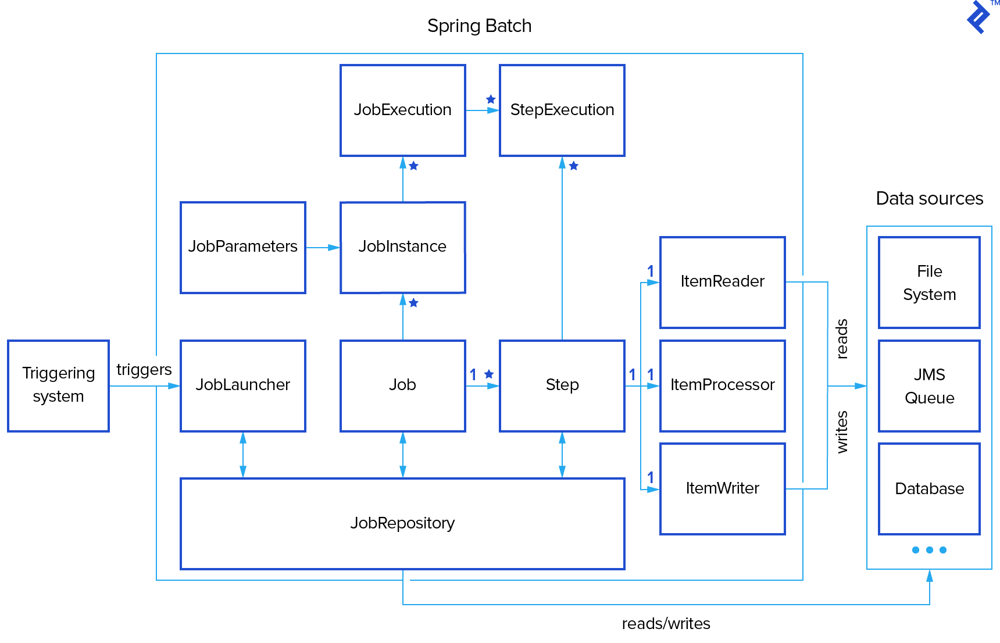
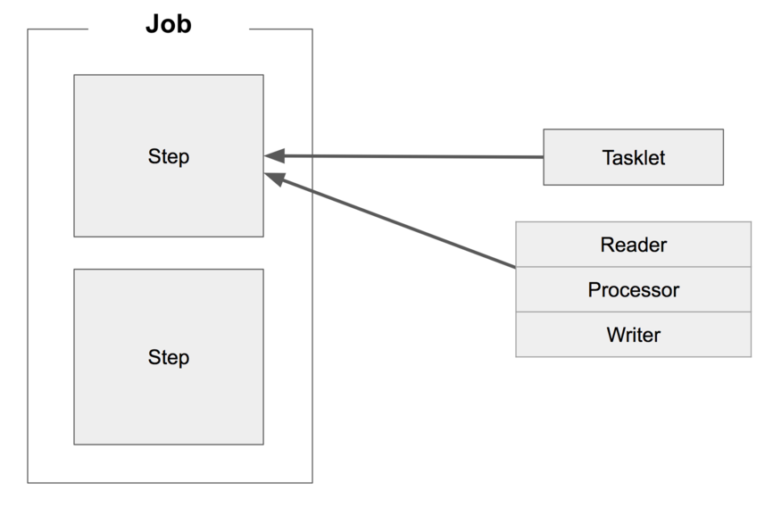

# spring batch
## 스프링 부트 + 스프링 배치 시작하기
개발환경   
- IntelliJ IDEA 2021.1
- spring boot 2.5.5
- Java 8
- Maven
- MariaDB 10.4.20

pom.xml
```xml
<dependency>
  <groupId>org.springframework.boot</groupId>
  <artifactId>spring-boot-starter-batch</artifactId>
</dependency>
<!-- JDBC  -->
<dependency>
  <groupId>org.mariadb.jdbc</groupId>
  <artifactId>mariadb-java-client</artifactId>
</dependency>
<dependency>
  <groupId>org.springframework.batch</groupId>
  <artifactId>spring-batch-test</artifactId>
  <scope>test</scope>
</dependency>
```
Java Config
```java
@Configuration
@EnableBatchProcessing
public class BatchConfig {
  ...
}
```
application.yml
```yaml
spring:
  datasource:
    url: jdbc:mariadb://localhost:3306/batch?profileSQL=true
    username: root
    password: 111111
  batch:
    job:
      names: ${job.name:NONE} # Program arguments로 job.name 값이 넘어오면 해당 값과 일치하는 Job만 실행
      enabled: false # 프로젝트 시작시 Job 실행 안함
    jdbc:
      initialize-schema: never  # 메타 데이터 테이블 생성 안함, always:메타 테이블 생성
```

***
## Spring batch 
- 벡엔드의 배치처리 기능을 구현하는 데 사용하는 프레임워크이며 스프링 부트 배치는 스프링 배치 설정   
  요소들을 간편화시켜 스프링 배치를 빠르게 설정하는 데 도움을 준다.
- 사람들이 기대하는 Spring Framework의 특성(생산성, POJO 기반 개발 접근 방식 및 일반적인 사용 용이성)을  
  기반으로 하는 동시에 개발자가 필요할 때 보다 고급 엔터프라이즈 서비스에 쉽게 액세스하고 활용할 수 있도록 한다.  
- 로깅/추적, 트랜잭션 관리, 작업 처리 통계, 작업 재시작, 건너뛰기, 리소스 관리 등   
  대용량 레코드 처리에 필수적인 재사용 가능한 기능을 제공한다.



***
## Spring batch 이해하기
배치의 일반적인 시나리오
- 읽기(read) : 데이터 저장소(일반적으로 데이터베이스)에서 특정 데이터 레코드를 읽습니다.
- 처리(processing) : 원하는 방식으로 데이터 가공/처리 합니다.
- 쓰기(write) : 수정된 데이터를 다시 저장소(데이터베이스)에 저장합니다.


Spring Batch에서 Job은 하나의 배치 작업 단위 뜻하며 Job 안에는 아래처럼 여러 Step이 존재하고  
Step 안에 Tasklet 혹은 Reader & Processor & Writer 묶음이 존재한다.  
>Tasklet 하나와 Reader & Processor & Writer 한 묶음이 같은 레벨이기 때문에  
Reader & Processor가 끝나고 Tasklet으로 마무리 하게 만들순 없다



Spring Batch 4.0 (Spring Boot 2.0) 에서 지원하는 Reader & Writer  

| DataSource | 기술      | 설명                                       |
|------------|-----------|--------------------------------------------|
| Database   | JDBC      | 페이징, 커서, 일괄 업데이트 등 사용 가능   |
| Database   | Hibernate | 페이징, 커서 사용 가능                 |
| Database   | JPA       | 페이징 사용 가능 (현재 버전에선 커서 없음) |
| File       | Flat file | 지정한 구분자로 파싱 지원              |
| File       | XML       | XML 파싱 지원                      |

***
## Spring Batch 메타 테이블
application.yml
```yaml
spring:
  batch:
    jdbc:
      initialize-schema: always
```

initialize-schema : 메타 테이블 생성 여부
- embedded : h2 등의 embedded db 일 경우 메타 테이블 생성
- always : 항상 생성
- never : 생성 안함

schema 위치 : `classpath:org/springframework/batch/core/schema-@@platform@@.sql`  
> initialize-schema embedded, always 일 경우 현재 연결된 DB에 맞는 메타 테이블 스키마 생성 sql 실행


### 메타 테이블 종류
- [BATCH_JOB_INSTANCE](#batch_job_instance)
- [BATCH_JOB_EXECUTION](#batch_job_execution)
- [BATCH_JOB_EXECUTION_CONTEXT](#batch_job_execution_context)
- [BATCH_JOB_EXECUTION_PARAMS](#batch_job_execution_params)
- [BATCH_JOB_EXECUTION_SEQ](#_seq)
- [BATCH_JOB_SEQ](#_seq)
- [BATCH_STEP_EXECUTION](#batch_step_execution)
- [BATCH_STEP_EXECUTION_CONTEXT](#batch_step_execution_context)
- [BATCH_STEP_EXECUTION_SEQ](#_seq)

#### BATCH_JOB_INSTANCE
Job이 실행될때에 생성되는 JobInstance에 관한 정보를 저장  
고유한 JobParameter값에 따라 새로 생성

| column | description |
|--------|-------------|
| JOB_INSTANCE_ID | 실행된 Job을 고유하게 식별될할 수 있는 기본 키 |
| VERSION | 해당 레코드에 update 될때마다 1씩 증가 |
| JOB_NAME | JobBuilderFactory에서 get메서드를 통해 부여한 이름 |
| JOB_KEY | 고유한 JobParameter 값의 직렬화(serialization)된 결과를 기록 |

<br/>

#### BATCH_JOB_EXECUTION
Job 실행 내용을 담고 있다. Job의 실패 + 성공 횟수만큼 row가 생성된다.

| column | description |
|--------|-------------|
| JOB_EXECUTION_ID | JobInstance에 대한 JobExecution을 고유하게 식별될할 수 있는 기본 키 | 
| VERSION | 해당 레코드에 update 될때마다 1씩 증가 |
| JOB_INSTANCE_ID | JobInstance 외래키 |
| CREATE_TIME | 실행(Execution)이 생성된 시점의 TimeStamp |
| START_TIME |실행(Execution)이 시작된 시점의 TimeStamp |
| END_TIME | 실행이 성공 또는 실패와 상관없이 종료된 시점의 TimeStamp <br/> 실행 중 일부유형의 오류가 발생했거나 프레임워크 내부에서 값을 저장하기도 전에  <br/>  실패되었을 경우 값이 비어 있을 수 있다 |
| STATUS | 실행의 상태를 BatchStatus Enum 으로 기록 |
| EXIT_CODE | 실행 종료코드를 기록 |
| EXIT_MESSAGE | Status가 실패(Fail)일 경우 실패한 원인에 대하여 문자열형태로 기록 |
| LAST_UPDATED | 실행(Execution)이 마지막으로 영속(persisted)에 놓인 시점의 TimeStamp |

<br/>

#### BATCH_JOB_EXECUTION_CONTEXT
Job의 ExecutionContext와 관련된 모든 정보를 기록  
한개의 JobExecution에 각 JobExecutionContext가 있으며 특정 작업 실행에 필요한 모든 작업 레벨 데이터를 포함  
일반적으로 JobInstance가 중지 된 위치에서 다시 시작할 수 있도록, 실패(Fail)이후 지점에 State를 나타낸다

| column | description |
|--------|-------------|
| JOB_EXECUTION_ID | 기본키 & jobExecution 외래 키 |
| SHORT_CONTEXT | SERIALIZED_CONTEXT의 버전을 나타내는 문자열 |
| SERIALIZED_CONTEXT | 직렬화(serialized)된 전체 컨텍스트 |

<br/>

#### BATCH_JOB_EXECUTION_PARAMS
JobParameter에 대한 모든정보를 기록  
JobParameter값에 따라 JobInstance가 생성되며 동일한 JobParameter값으로   
실행하면 BATCH_JOB_INSTANCE 테이블에 기록되지 않는다.

<br/>

#### BATCH_STEP_EXECUTION
JobExecution에 대한 Step객체 정보를 기록

| column | description |
|--------|-------------|
| STEP_EXECUTION_ID | Step에 대한 실행횟수정보를 고유하게 식별될할 수 있는 기본 키 |
| VERSION | 해당 레코드에 update 될때마다 1씩 증가 |
| STEP_NAME | StepBuilderFactory에서 get메서드를 통해 부여한 이름 |
| JOB_EXECUTION_ID | jobExecution 외래 키 | 
| START_TIME | 실행(Execution)이 시작된 시점의 TimeStamp |
| END_TIME | 실행이 성공 또는 실패와 상관없이 종료된 시점의 TimeStamp <br/> 실행 중 일부유형의 오류가 발생했거나 프레임워크 내부에서 값을 저장하기도 전에  <br/>  실패되었을 경우 값이 비어 있을 수 있다 |
| STATUS | 실행의 상태를 BatchStatus Enum 으로 기록 |
| COMMIT_COUNT | Chunk 단위 트랜잭션 당 커밋되는 수를 기록 |
| READ_COUNT | 실행시점에 Read한 Item 수를 기록 |
| FILTER_COUNT | 실행도중 필터링된 Item 수를 기록 |
| WRITE_COUNT | 실행도중 저장되고 커밋된 Item 수를 기록 |
| READ_SKIP_COUNT | 실행도중 Read가 스킵(Skip)된 Item 수를 기록 | 
| WRITE_SKIP_COUNT | 실행도중 write가 스킵(Skip)된 Item 수를 기록 | 
| PROCESS_SKIP_COUNT | 실행도중 Process가 스킵(Skip)된 Item 수를 기록 | 
| ROLLBACK_COUNT | 실행도중 rollback이 일어난 수를 기록<br/>재시도를 위한 롤백과 복구 건너뛰기 절차의 롤백을 포함하여 롤백이 발생할 때마다 포함 |
| EXIT_CODE | 실행 종료코드를 기록 |
| EXIT_MESSAGE | Status가 실패(Fail)일 경우 실패한 원인에 대하여 문자열형태로 기록 |
| LAST_UPDATED | 실행(Execution)이 마지막으로 영속(persisted)에 놓인 시점의 TimeStamp |

<br/>

#### BATCH_STEP_EXECUTION_CONTEXT
Step의 ExecutionContext와 관련된 모든 정보를 기록  
한개의 StepExecution에 각 StepExecutionContext가 있으며 특정 작업 실행에 필요한 모든 작업 레벨 데이터를 포함  
일반적으로 JobInstance가 중지 된 위치에서 다시 시작할 수 있도록, 실패(Fail)이후 지점에 State를 나타낸다

| column | description |
|--------|-------------|
| JOB_EXECUTION_ID | 기본키 & StepExecution 외래 키 |
| SHORT_CONTEXT | SERIALIZED_CONTEXT의 버전을 나타내는 문자열 |
| SERIALIZED_CONTEXT | 직렬화(serialized)된 전체 컨텍스트 |

<br/>

#### *_SEQ
시퀀스관리 테이블
- BATCH_JOB_SEQ
- BATCH_JOB_EXECUTION_SEQ
- BATCH_STEP_EXECUTION_SEQ

***
## Tasklet
**Tasklet**은 Step안에서 단일로 수행될 커스텀한 기능들을 선언할때 사용함  
Step은 Tasklet 단위로 처리되고, Tasklet 중에서 ChunkOrientedTasklet을 통해  
Chunk를 처리하며 이를 구성하는 3 요소로 ItemReader, ItemWriter, ItemProcessor 가 있다

> ItemReader & ItemWriter & ItemProcessor의 묶음 == Tasklet

***
## ItemReader
**ItemReader**는 Step의 대상이 되는 배치 데이터를 읽어오는 인터페이스이다.  
File, Xml Db등 여러 타입의 데이터를 읽어올 수 있다.

Spring Batch의 Reader에서 읽어올 수 있는 데이터 유형
- 입력 데이터에서 읽어오기
- 파일에서 읽어오기
- Database에서 읽어오기
- Java Message Service등 다른 소스에서 읽어오기
- 본인만의 커스텀한 Reader로 읽어오기

**Database Reader**
- Cursor ItemReader : ResultSet이 open 될 때마다 next() 메소드가 호출 되어 Database의 데이터가 반환
  - JdbcCursorItemReader
  - HibernateCursorItemReader
  - StoredProcedureItemReader
- Paging ItemReader : 페이지라는 Chunk로 Database에서 데이터를 검색
  - JdbcPagingItemReader
  - HibernatePagingItemReader
  - JpaPagingItemReader
  - RepositoryItemReader

***
## ItemProcessor
**ItemProcessor**는 필수가 아니며 가공 (혹은 처리) 단계임  
Reader, Writer 와는 별도의 단계로 분리되었기 때문에 **비지니스 코드가 섞이는 것을 방지**  
읽어온 배치 데이터와 쓰여질 데이터의 타입이 다를 경우 처리 가능

값을 **변환** 또는 **필터** 역할을 할 수 있음

```java
public interface ItemProcessor<I, O> {

  @Nullable
  O process(@NonNull I item) throws Exception;
}
```
ItemProcessor 인터페이스는 두 개의 제네릭 타입이 필요함
- I : ItemReader에서 받을 데이터 타입
- O : ItemWriter에 보낼 데이터 타입

ItemReader 에서 넘어오는 값은 Null 일 수 없으며  
리턴값이 Null 일 경우 ItemWriter로 보내지 않음

***
## ItemWriter
**ItemWriter**는 배치 데이터를 저장하며 일반적으로 DB나 파일에 저장한다.  
item을 하나씩 처리하지 않고 Chunk 단위로 묶인 item List 로 처리
```java
public interface ItemWriter<T> {
  void write(List<? extends T> items) throws Exception;
}
```

ItemWriter 에 데이터 전달 되는 순서
- ItemReader를 통해 각 항목을 개별적으로 읽고 이를 처리하기 위해 ItemProcessor에 전달
- 이 프로세스는 청크의 Item 개수 만큼 처리 될 때까지 지속
- 청크 단위만큼 처리가 완료되면 Writer에 전달  
> Reader와 Processor를 거쳐 처리된 Item을 Chunk 단위 만큼 쌓은 뒤 이를 Writer에 전달된다.

**Database Writer**
- JdbcBatchItemWriter : JDBC의 Batch 기능을 사용하여 한번에 Database로 전달
- JpaItemWriter
- HibernateItemWriter

**JdbcBatchItemWriter**  
JDBC의 Batch 기능을 사용하여 한번에 Database로 전달하여 Database 내부에서 쿼리들이 실행

JdbcBatchItemWriterBuilder 설정값

| Property   | Parameter<br/>Type      | 설명                     |
|------------|-----------|--------------------------------------|
| columnMapped | 없음 | Key,Value 기반으로 Insert SQL의 Values를 매핑 |
| beanMapped   | 없음 | Pojo 기반으로 Insert SQL의 Values를 매핑      |

> JdbcBatchItemWriter의 제네릭 타입은 Reader/Processor에서 넘겨준 클래스이다.

**JpaItemWriter**  
Writer에 전달하는 데이터가 Entity 클래스라면 JpaItemWriter를 사용하여 저장
```java
JpaItemWriter<User> writer = new JpaItemWriterBuilder<User>()
    .entityManagerFactory(entityManagerFactory)
    .usePersist(true)
    .build();
```

해당 빌더 메서드중 usePersist 옵션 (default false) 의 설정에 따라 persist or merge 호출
> 트랜잭션이 chunk 단위 이므로 User Entity 는 detach 상태가 아니지만  
> 내부에서 merge 를 호출하므로 id가 세팅 되어 있을 경우 select, insert 발생함

```java
public class JpaItemWriter<T> implements ItemWriter<T>, InitializingBean {

  protected void doWrite(EntityManager entityManager, List<? extends T> items) {
    ...
    if(usePersist) {
      entityManager.persist(item);
    } else {
      entityManager.merge(item);
    }
    ...
  }
}
```

***
## @JobScope, @StepScope, JobParameter
스프링 bean 의 기본 Scope 는 싱글톤임  
@JobScope, @StepScope 선언시 Bean의 생성 시점을 지정된 Scope가 실행되는 시점으로 지연시킨다


- @JobScope  
  **Step 선언문**에서 사용 가능  
  Job 실행시점에 Bean이 생성되며 Job이 끝나면 삭제됨


- @StepScope
  **Tasklet**이나 **ItemReader**, **ItemWriter**, **ItemProcessor**에서 사용 가능  
  Step 실행시점에 Bean이 생성되며 Step이 끝나면 삭제됨
  

- JobParameter
  Job 실행시 전달된 파라미터 값을 받을 수 있음  
  java -jar *.jar --param=value 로 넣어준다 (Program Arguments)  
  Spring Batch는 같은 JobParameter로 같은 Job을 두 번 실행하지 않는다
  ```java
  @Value("#{jobParameters[file]}")
  private String file;
  ```
  Scope Bean을 생성할때만 가능

***
## Batch Status vs. Exit Status  
**Batch Status**
- Job 또는 Step 의 실행 결과를 Spring에서 기록할 때 사용하는 Enum

**Exit Status**
- Step의 실행 후 상태, Enum 이 아니다

> Spring Batch는 기본적으로 ExitStatus의 exitCode는 Step의 BatchStatus와 같도록 설정되어 있다

***
## MySQL (MariaDB) 배치설정
```yaml
spring:
  jpa:
    properties:
      "[hibernate.jdbc.batch_size]": 100
```
**org.hibernate.SQL 의 쿼리는 단건씩 출력됨**  
- MySQL JDBC의 경우 JDBC URL에 rewriteBatchedStatements=true 옵션을 추가해주면 된다.  
- MySQL의 경우 실제로 생성된 쿼리는 logger=com.mysql.jdbc.log.Slf4JLogger&profileSQL=true 옵션으로 로그를 통해 확인할 수 있다.

```yaml
spring:
  datasource:
    ...
    url: jdbc:mariadb://localhost:3306/batch?rewriteBatchedStatements=true&profileSQL=true&logger=Slf4JLogger&maxQuerySizeToLog=999999
    ...
```
- profileSQL=true : Driver 에서 전송하는 쿼리를 출력
- logger=Slf4JLogger : Driver 에서 쿼리 출력시 사용할 로거를 설정
    - MySQL 드라이버 : 기본값은 System.err 로 출력하도록 설정되어 있기 때문에 **필수**
    - MariaDB 드라이버 : Slf4j 를 이용하여 로그를 출력하기 때문에 설정할 필요가 **없음**
- maxQuerySizeToLog=999999 : 출력할 쿼리 길이
    - MySQL 드라이버 : 기본값 0
    - MariaDB 드라이버 : 기본값 1024

- **MariaDB Driver 의 경우 rewriteBatchedStatements 가 false 일 경우  
useBatchMultiSend 가 true 쿼리를 배치로 실행 하는데 useBatchMultiSend 기본값이 true**
  
- ID 가 자동증가 값 일 경우 (GenerationType.IDENTITY 을 사용할 경우) 하이버네이트는 batch insert 를 비활성화 


## 참조
- [spring-batch-reference](https://docs.spring.io/spring-batch/docs/4.3.x/reference/html)
- [spring batch 간단 정리](https://cheese10yun.github.io/spring-batch-basic/#null)
- [spring-batch-in-action / github](https://github.com/jojoldu/spring-batch-in-action)
- [MySQL 환경의 스프링부트에 하이버네이트 배치 설정 해보기](https://techblog.woowahan.com/2695/)