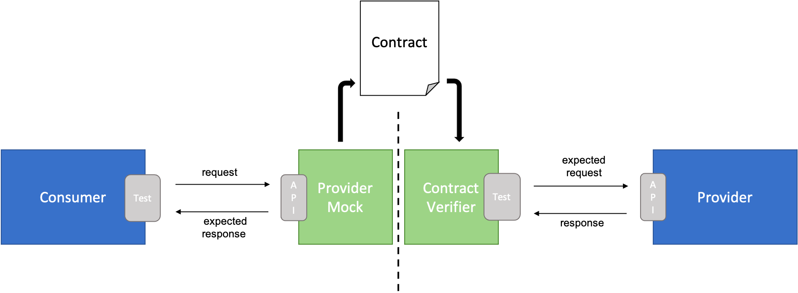
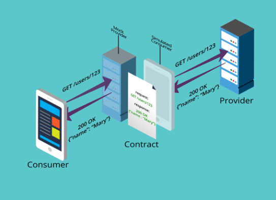
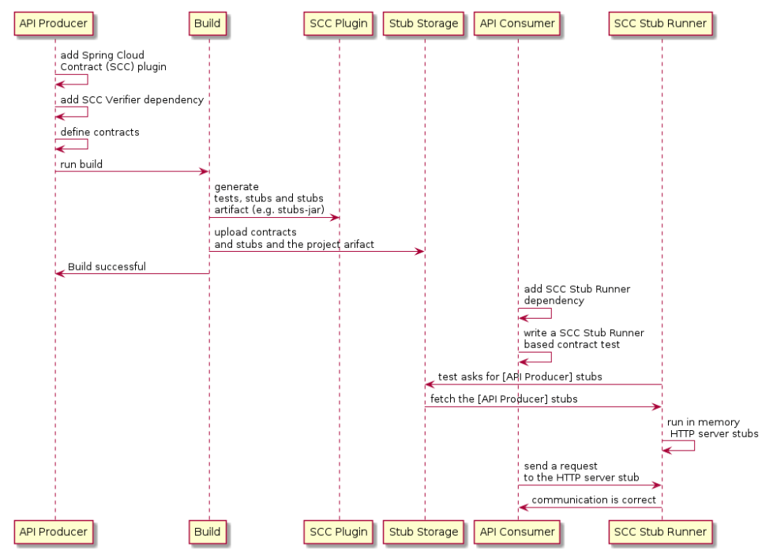

# Spring Cloud Contract Stub Runner

## 소비자 주도 계약 패턴(Consumer-Driven Contract) 이란?

제공자(Producer) 가 소비자(Consumer) 에 대한 기대치와 호환되는지 확인하면서 격리된 시스템 구성 요소를 테스트하는데   
사용되는 소프트웨어 테스트 방법론이다.

즉, 소비자의 요구사항을 중심으로 제공자의 서비스를 진화 시키기위한 방법이다.

### Why CDC ?

CDC 는 자동화된 E2E (End to End) 테스트의 몇가지 단점을 극복하려고 한다.

- E2E 테스트가 느리다.
- E2E 테스트는 쉽게 중단된다.
- E2E 테스트는 비용이 많이 들고 유지 관리가 어렵다.
- 대규모 시스템의 E2E 테스트는 전용 테스트 환경 외부에서 실행하기 어렵거나 불가능할 수 있다.

CDC 는 공유되어 문서화 되어있는 **Contract** 를 따르는 Mocking 을 통하여 격리된 components 간의  
상호 작용을 테스트하여 이러한 문제를 해결한다.

### CDC Testing Frameworks and Tools

#### [Pact](https://docs.pact.io/)

Pact 는 Contract 에 사양을 정의하면서 소비자 코드베이스에서 Response 를 Mocking 하고 공급자 코드베이스에서   
이에 대한 상호 작용을 검증할 수 있는 CDC 테스트의 구현이다.

- 출처 : [pactflow.io, how-pact-works](https://pactflow.io/how-pact-works/#slide-1)

#### [Spring Cloud Contract](https://cloud.spring.io/spring-cloud-contract/reference/html/)

Spring 의 CDC 테스트를 구현한 것으로 Spring 생태계에 쉽게 통합할 수 있도록 한다.

## Spring Cloud Contract 란?

### 개요

Spring Cloud Contract 는 TDD 를 소프트웨어 아키텍처 수준으로 이동시킨다.  
이를 통해 CDC(Consumer Driven Contract) 테스트를 수행할 수 있도록 지원한다.

Spring 에서 CDC 테스트를 구현한 것으로 Spring 에 쉽게 통합할 수 있도록 지원한다.

Http 통신, Messaging 통신 지원.

### 필요성

E2E 테스트의 단점과 단순히 Mocking 을 통하여 테스트를 진행하였을때 단점들을 보완하기 위해 나타남.  
Producer 에서 테스트후에 생성된 stub 을 Consumer 에서 실행하여 테스트하므로 정확하고 빠르게 테스트가 가능하다.

### UML diagram

Pact 와 반대로 Producer 측에서 Contract 를 등록한다.

### Spring Cloud Contract Workflow

#### Consumer Side

1. Consumer 측에서 테스트중 Producer 측의 API 가 필요할 경우 Producer 프로젝트를 Clone 한다.
2. Producer 프로젝트에 Contract 를 작성한다.
3. Spring Cloud Contract(SCC) 플러그인을 추가한다.
4. maven install 후에 생성되어 repository 에 배포되어 있는 stub.jar 를 확인한다.
5. Consumer 프로젝트에서 stub.jar 를 활용하여 통합 테스트를 진행한다.
6. 결과에 만족하는 테스트 결과가 나왔을 경우 Producer 프로젝트에 pull request 를 보낸다.

#### Producer Side

1. Pull request 요청을 확인한다.
2. 자동 생성된 테스트를 검증하기 위해 종속성을 추가한다. (spring-cloud-starter-contract-verifier)
3. maven 을 통하여 test 를 수행한다.
4. Consumer 측에서 추가한 Contract 를 구현하지 않아 테스트가 실패한다.
5. Contract 에 맞춰 누락된 구현을 작성한다.
6. pull request 을 merge 한다.
7. Producer 어플리케이션과 stub.jar 를 배포한다.

### Spring Cloud Contract Verifier 란?

Producer 측에서 Contract 등록을 위해 필요하다.  
groovy, yaml(yml), Java, Kotlin 을 통하여 Contract 를 작성하며 플러그인과 같이 세팅할 경우  
추가된 Contract 를 준수하는지 확인하는 테스트가 자동으로 생성된다.

maven install 을 진행하면 stub.jar 가 생성된다.

### Spring Cloud Contract Stub Runner 란?

Consumer 측에서 사용하며 Producer 생성한 Stub 과 함께 테스트를 진행한다.   
실제 서비스를 시뮬레이션하는 실행 중인 WireMock 인스턴스를 사용한다.

### Spring Cloud Contract Wiremock 이란?

Spring Boot 애플리케이션 에서 WireMock 과의 통합을 지원한다.  
`@AutoConfigureWireMock` 을 통하여 WireMock 을 테스트시에 스텁 서버로 실행 가능하다.

json 또는 java dsl 을 사용하여 Wiremock 을 스텁 동작을 등록할 수 있다. 

## 참조
- [Spring Cloud Contract Stub Runner](https://docs.spring.io/spring-cloud-contract/docs/current/reference/html/project-features.html#features-stub-runner)
- [Spring Cloud Contract WireMock](https://docs.spring.io/spring-cloud-contract/docs/current/reference/html/project-features.html#features-wiremock)
- [WireMock](https://wiremock.org/docs/)
- [CDC, MS Reference](https://microsoft.github.io/code-with-engineering-playbook/automated-testing/cdc-testing/)
- [Pact](https://docs.pact.io/)
