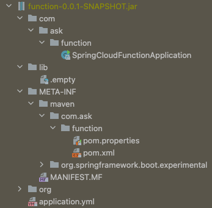
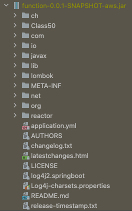

# Spring Cloud Function

## [AWS Deploy](https://docs.spring.io/spring-cloud-function/docs/current/reference/html/spring-cloud-function.html#_aws_request_handlers)

요청 핸들러
> MAIN_CLASS=org.springframework.cloud.function.adapter.aws.FunctionInvoker::handleRequest

둘 이상 Function 이 있을 경우 하단 프로퍼티 지정.  
환경변수는 대문자 언더스코어로 지정해야 스프링에서 인식함. [Binding from Environment Variables](https://docs.spring.io/spring-boot/docs/current/reference/html/features.html#features.external-config.typesafe-configuration-properties.relaxed-binding.environment-variables)
- Replace dots (.) with underscores (_).
- Remove any dashes (-).
- Convert to uppercase.

> SPRING_CLOUD_FUNCTION_DEFINITION=uppercase

## [spring-boot-thin-layout](https://github.com/spring-projects-experimental/spring-boot-thin-launcher)
Spring Boot 의 빌드 결과를 uber(fat) jar 가 아닌 실행 가능한 thin jar 로 생성하는 플러그인

### 동작구조
1. jar 내부에 ThinJarWrapper 가 추가된다.
2. jar 내부에 pom.xml 또는 META-INF/thin.properties 읽어 의존성을 다운로드한다.

하단과 같은 형태로 외부에 저장되는 의존성 위치를 지정 할 수 있다.
> java -jar function-0.0.1-SNAPSHOT.jar --thin.root=.

### 생성된 JAR (11KB)

## [maven-shade-plugin](https://maven.apache.org/plugins/maven-shade-plugin/)
프로젝트 클래스를 종속성과 함께 단일 uber-jar 로 재패키징하여 선택적으로 클래스 이름을   바꾸거나 사용하지 않는 클래스를 제거한다.

### 생성된 JAR (23.2MB)

## 참조
- [Spring Cloud Function, Reference](https://docs.spring.io/spring-cloud-function/docs/3.2.1/reference/html/)
- [Spring Cloud Function, GitHub](https://github.com/spring-cloud/spring-cloud-function)
- [Blog 1, Introduce](https://binux.tistory.com/61?category=907689)
- [Blog 2, AWS Deploy](https://siyoon210.tistory.com/174)
