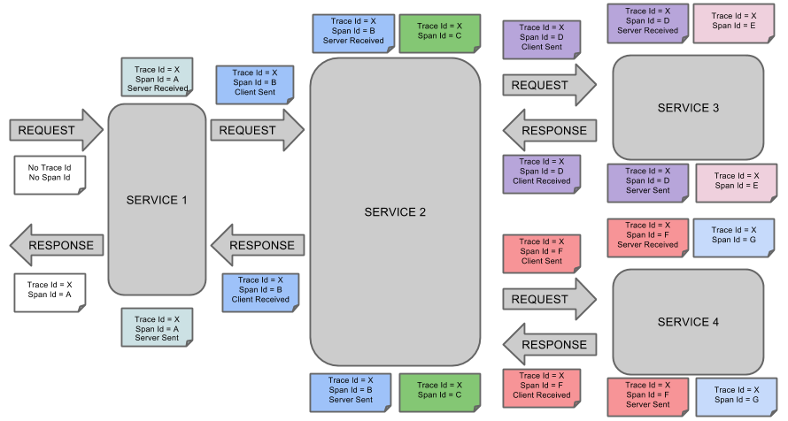
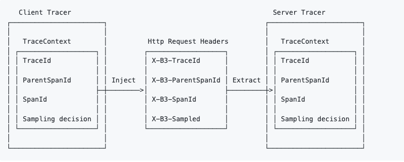
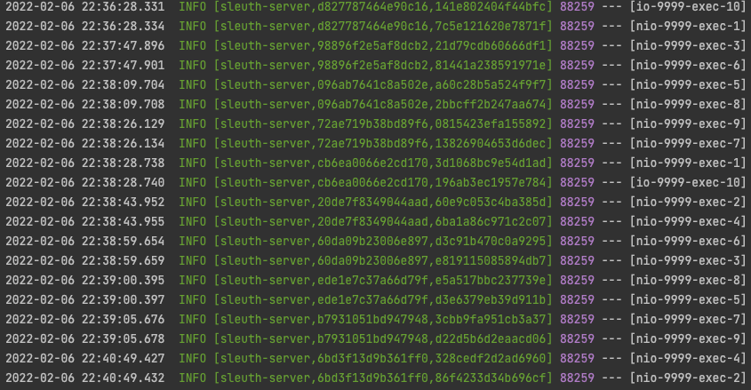

# Spring Cloud Sleuth

## Sleuth 란?
Spring Cloud 용 분산 추적 솔루션용 API 를 제공 하며, OpenZipkin Brave 와 통합을 지원한다.

요청과 메시지를 추적할 수 있으므로 해당 통신을 해당 로그 항목과 연관시킬 수 있다.   
추적 정보를 외부 시스템으로 내보내 대기 시간을 시각화할 수도 있다.

OpenZipkin 호환 시스템을 직접 지원한다.
[Dapper](https://research.google/pubs/pub36356/) 의 용어를 사용한다.

### 용어 및 흐름
Trace Id
- 64-bit 혹은 128-bit의 ID이다. trace의 모든 span은 이 ID를 공유한다.

Span Id
- 특정한 span의 ID이다. root span의 경우 trace ID와 동일하다.

Parent Id
- 하위 span에만 표시되는 선택적 ID이다. 부모 ID가 없는 span은 trace의 root(=root span)로 간주된다.



### Zipkin 헤더, b3-propagation
[B3 propagation](https://github.com/openzipkin/b3-propagation) 은 간단히 말해 ‘X-B3-‘으로 시작하는 4개 값을 전달하는 것을 통해서 트레이스 정보를 관리하는것을 말한다.
- X-B3-TraceId
- X-B3-ParentSpanId
- X-B3-SpanId
- X-B3-Sampled  



## Sleuth Log
`[spring.application.name, traceId, spanId]`



##  OpenTracing
CNCF(Cloud Native Computing Foundation) 에서 만든 비공식 분산 추적 표준이다.  
대표적인 구현체로 Jaeger, Zipkin 등이 있다.

## Zipkin
분산 추적 시스템이며 서비스 아키텍처의 대기 시간 문제를 해결하는 데 필요한 타이밍 데이터를 수집하는 데 도움이 된다.  
기능에는 이 데이터의 수집 및 조회가 모두 포함된다.

### docker (In-memory 방식)
```shell
$ docker run -d -p 9411:9411 --name zipkin openzipkin/zipkin
```

## 참조
- [Spring Cloud Sleuth, Reference](https://docs.spring.io/spring-cloud-sleuth/docs/3.1.0/reference/html/index.html)
- [Spring Cloud Sleuth 2.2.4, 번역](https://velog.io/@hanblueblue/%EB%B2%88%EC%97%AD-Spring-Cloud-Sleuth-1-Introduction)
- [zipkin, Reference](https://zipkin.io/)
- [zipkin, dockerhub](https://hub.docker.com/r/openzipkin/zipkin/)
- [Blog 1, Distributed Tracing](https://ksr930.tistory.com/112)
- [Blog 2](https://happycloud-lee.tistory.com/216?category=902419)
- [Blog 3](https://velog.io/@hanblueblue/Spring-boot%EB%A1%9C-Spring-Cloud-Sleuth-Zipkin-%EC%8B%A4%EC%8A%B5)
