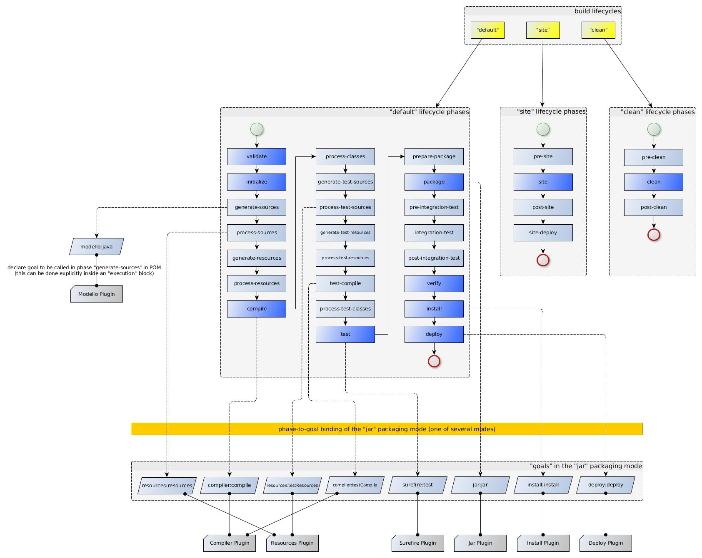

# spring dbunit

## spring boot + dbunit
개발환경
- IntelliJ IDEA 2021.1
- spring boot 2.5.5
- Java 8
- Maven

pom.xml
```xml
<dependency>
  <groupId>org.springframework.boot</groupId>
  <artifactId>spring-boot-starter-web</artifactId>
</dependency>
<dependency>
  <groupId>org.springframework.boot</groupId>
  <artifactId>spring-boot-starter-data-jpa</artifactId>
</dependency>
<dependency>
  <groupId>org.mariadb.jdbc</groupId>
  <artifactId>mariadb-java-client</artifactId>
</dependency>
<dependency>
  <groupId>org.dbunit</groupId>
  <artifactId>dbunit</artifactId>
  <version>2.7.0</version>
  <scope>test</scope>
</dependency>
```

***
## Test LifeCycle 이전에 DBUnit 실행
- 테스트를 Goal 을 처리하는 maven-surefire-plugin 플러그인 설정
- default automatically include wildcard patterns
  - `**/Test*.java`
  - ` **/*Test.java`
  - ` **/*Tests.java`
  - `**/*TestCase.java`
- test-compile phase 이후에 특정 테스트 동작하게함

```xml
<plugin>
  <groupId>org.apache.maven.plugins</groupId>
  <artifactId>maven-surefire-plugin</artifactId>
  <executions>
    <execution>
      <id>initDB-on</id> <!-- id 지정, 한개일 경우 안해도됨  -->
      <goals>
        <goal>test</goal> <!-- 해당 플러그인의 test goal 일 경우 동작  -->
      </goals>
      <phase>test-compile</phase> <!-- test-compile 이후에 동작  -->
      <configuration>
        <includes>
          <include>com.ask.springdbunit.InitDB</include>
        </includes>
      </configuration>
    </execution>
  </executions>
</plugin>
```

### 실행 결과
```text
--- maven-resources-plugin:3.2.0:resources (default-resources) @ spring-dbunit ---
--- maven-compiler-plugin:3.8.1:compile (default-compile) @ spring-dbunit ---
--- maven-resources-plugin:3.2.0:testResources (default-testResources) @ spring-dbunit ---
--- maven-compiler-plugin:3.8.1:testCompile (default-testCompile) @ spring-dbunit ---
--- maven-surefire-plugin:2.22.2:test (initDB-on) @ spring-dbunit ---
--- maven-surefire-plugin:2.22.2:test (default-test) @ spring-dbunit ---
--- maven-jar-plugin:3.2.0:jar (default-jar) @ spring-dbunit ---
--- spring-boot-maven-plugin:2.5.5:repackage (repackage) @ spring-dbunit ---
--- maven-install-plugin:2.5.2:install (default-install) @ spring-dbunit ---
```
***
## Maven Goal, Phase


***
## 참고 사항
- Intellij DbUnit Extractor 플러그인 설치

***
## 참조
- [Maven, Using JUnit 5 Platform](https://maven.apache.org/surefire/maven-surefire-plugin/examples/junit-platform.html)
- [Maven, Inclusions and Exclusions of Tests](https://maven.apache.org/surefire/maven-surefire-plugin/examples/inclusion-exclusion.html)
- [dbunit docs](http://dbunit.sourceforge.net/components.html)
- [스프링부트에서 DbUnit 을 이용하여 DB 테스트 해보기](https://techblog.woowahan.com/2650)
