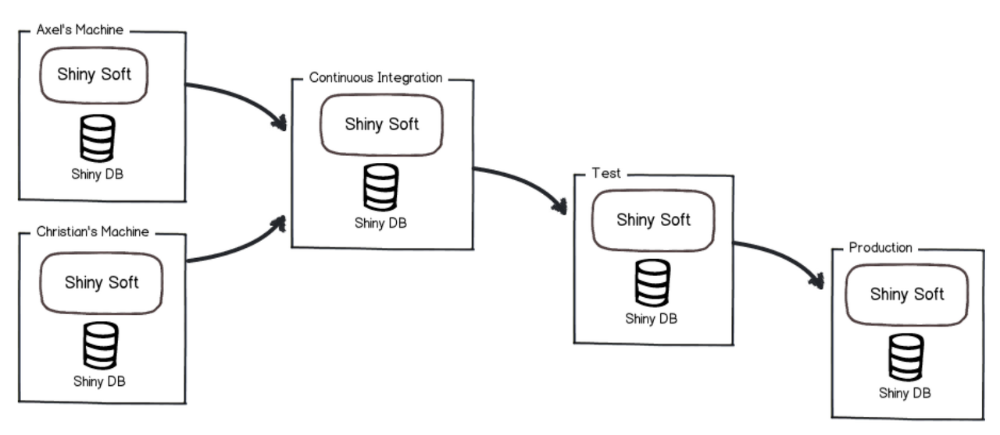
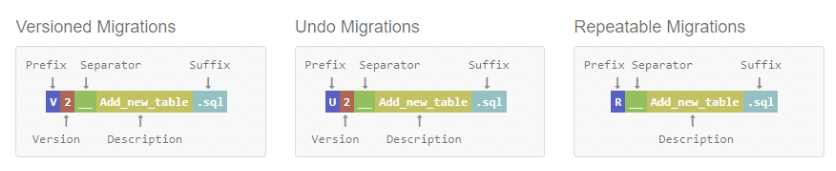

# Spring Flyway

```xml
<dependency>
  <groupId>org.flywaydb</groupId>
  <artifactId>flyway-core</artifactId>
</dependency>
```

## Flyway 란?

Flyway 는 오픈 소스 데이터베이스 마이그레이션 툴이며 데이터베이스의 형상관리를 목적으로 사용하며  
데이터베이스의 DDL 의 이력을 쌓아서 관리해준다.



### Naming Convention



- Prefix: V, U, R 중 하나 선택
  - V(Version): 버전 마이그레이션
  - U(Undo): 실행 취소
  - R(Repeatable): 반복 가능한 마이그레이션, 매번 실행되며 버전은 사용하지 않음
- Version: 버전정보, 점 또는 밑줄을 사용함. (Repeatable 은 사용하지 않음)
- Separator: __ (2개의 밑줄 사용)
- Description: 실질적인 파일명이며 공백이나 밑줄로 구분
- Suffix: 접미사 주로 .sql 사용

### Naming Convention Sample

- V1__init.sql
- V1.1__add_age_in_user.sql
- V2__add_company.sql
- V20220517__add conference.sql
- V20220518__add endpoint.sql

## 설정

flyway 를 사용하면서 `spring.jpa.hibernate.ddl-auto` 값을 따로 설정하지 않을 경우   
none 으로 설정된다. (`HibernateDefaultDdlAutoProvider` 에서 처리됨)

## property

### spring.flyway.baseline-on-migrate

메타데이터 테이블이 없는 비어 있지 않은 스키마에 대해 migration 이 실행될 때 자동으로 baseline 을 호출 할지 여부.  
baselineVersion 보다 위의 버전에 대해서 migration 한다.  
기존 DB가 있는 프로젝트에서 초기에 Flyway 를 적용할때 유용하다.

## 참조

- [Reference, Flyway](https://flywaydb.org/documentation/concepts/migrations)
- [Spring Boot Reference, Execute Flyway Database Migrations on Startup
  ](https://docs.spring.io/spring-boot/docs/current/reference/html/howto.html#howto.data-initialization.migration-tool.flyway)
