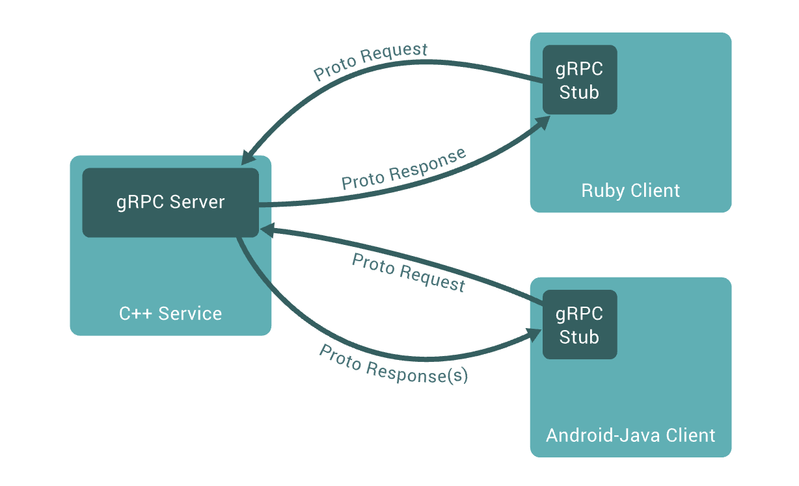
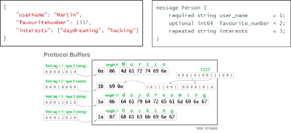
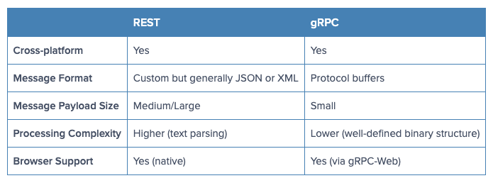
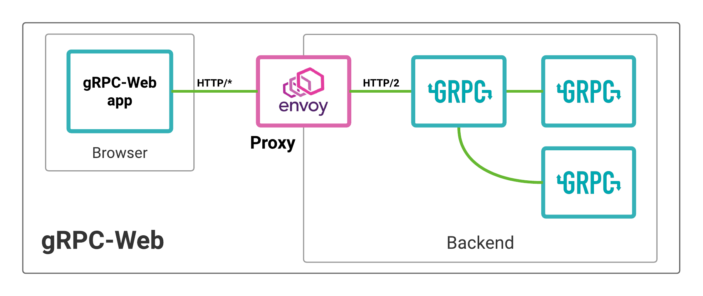

# Spring gRPC

## RPC

Remote Procedure Call 의 약자로 분산 네트워크 환경에서 네트워크 요청을 소프트웨어  
내부에 있는 함수를 호출하듯이 사용하게 도와주는 프로토콜이다.

- caller/callee
  - 개발자가 필요한 비지니스 로직을 생성하고 정의된 IDL(interface definition language)로  
    작성하여 stub 을 호출한다.
- Stub
  - Stub compiler 가 IDL 파일을 읽어 원하는 language 로 생성하고 파라미터를  
    마샬링/언마샬링 처리하여 RPC 프로토콜로 전달한다.
- RPC runtime
  - 통신하여 각 메세지를 전달한다.

구현의 어려움, 지원기능 한계 등으로 점차 사용하지 않게 되며  
이후 REST 방식을 사용 하게되었다.

## gRPC

google 에서 개발한 오픈소스 RPC(Remote Procedure Call) 프레임워크이다.  
전송을 위해 HTTP/2 를 사용한다.

- 높은 생산성과 효율적인 유지보수
- 다양한 언어와 플랫폼 지원
- 높은 메세지 압축률과 성능



### HTTP/2

HTTP/2는 HTTP/1 의 확장으로 기존의 HTTP/1과의 호환성을 유지하며 성능에 초점을 맞춘 프로토콜이다.

HTTP/2 와 HTTP/1.x와의 가장 큰 변화는 속도 향상이며  
성능 저하 부분과 비효율적인 부눈들을 개선하여 HTTP/2 가 탄생 하였다.

HTTP/2 는 하단과 같은 장점이 있다.

- Multiplexed Streams: 한 커넥션에 여러개의 메세지를 동시에 주고 받을 수 있음
- Stream Prioritization: 요청 리소스간 의존관계를 설정
- Server Push: HTML 문서상에 필요한 리소스를 클라이언트 요청없이 보내줄 수 있음
- Header Compression: Header 정보를 HPACK 압축방식을 이용하여 압축전송

[HTTP/2, 제대로 이해하기](https://gngsn.tistory.com/99)

### protobuf(protocol buffers)

google 에서 개발한 구조화된 데이터 직렬화 기법을 말한다.

IDL(Identity Definition Language)로 **protocol buffers(protobuf)** 사용한다.  
IDL 만 정의하면 높은 성능을 보장하는 서비스와 메세지에 대한 소스코드가 각 언어에 맞게 자동 생성된다.  

따라서 개발자들은 생성된 코드를 클라이언트, 서버 간의 사용 언어에 상관없이 사용하기만 하면 되며   
정해진 규약을 공통으로 사용하기 때문에 의사소통 비용이 감소하게 된다.

Protocol Buffer 로 직렬화 할 경우 필드 번호, 필드 유형 등을 1byte 로 받아서 식별하고  
주어진 length 만큼 읽도록 하여 용량을 최소화 한다.



- json: 82 bytes
- protobuf: 32 bytes

## REST vs gRPC



- 덜 엄격한 구조와 자주 데이터 포맷이 변경된다면 REST 가 적절함.
- 자주 변경되지 않으며 속도가 중요할 경우엔 gRPC 가 적절함.
- [baeldung, REST vs gRPC](https://www.baeldung.com/rest-vs-grpc)

## gRPC-web



- [github, gRPC-web](https://github.com/grpc/grpc-web)
- [docs, Basics tutorial gRPC-web](https://grpc.io/docs/platforms/web/basics/)
- [브라우저 앱에서 gRPC 사용](https://learn.microsoft.com/ko-kr/aspnet/core/grpc/browser?view=aspnetcore-7.0)

## [gRPCurl](https://github.com/fullstorydev/grpcurl)

```shell
# macOS
$ brew install grpcurl

# no TLS
$ grpcurl --plaintext -d '{"name": "test"}' localhost:9090 Simple/SayHello
{
  "message": "Hello: test"
}
```

## [Protocol Buffer Compiler Installation](https://grpc.io/docs/protoc-installation/)

```shell
$ brew install protobuf
$ protoc --version

# protobuf 위치로 이동
protoc -I . --java_out=. ./helloworld.proto
```

## 참조

- [gRPC](https://grpc.io/)
- [github, grpc-java](https://github.com/grpc/grpc-java)
- [yidongnan grpc-spring-boot-starter](https://github.com/yidongnan/grpc-spring-boot-starter)
- [LogNet grpc-spring-boot-starter](https://github.com/LogNet/grpc-spring-boot-starter)
- [gRPC 깊게 파고들기](https://medium.com/naver-cloud-platform/nbp-%EA%B8%B0%EC%88%A0-%EA%B2%BD%ED%97%98-%EC%8B%9C%EB%8C%80%EC%9D%98-%ED%9D%90%EB%A6%84-grpc-%EA%B9%8A%EA%B2%8C-%ED%8C%8C%EA%B3%A0%EB%93%A4%EA%B8%B0-1-39e97cb3460)
