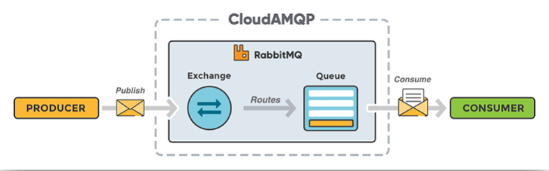

# spring amqp(rabbitmq), mqtt, integration

## spring boot + integration + amqp, mqtt
개발환경
- IntelliJ IDEA 2021.3
- spring boot 2.6.1
- Java 8
- Maven

pom.xml
```xml
<dependency>
  <groupId>org.springframework.boot</groupId>
  <artifactId>spring-boot-starter-amqp</artifactId>
</dependency>
<dependency>
  <groupId>org.springframework.boot</groupId>
  <artifactId>spring-boot-starter-integration</artifactId>
</dependency>
<dependency>
  <groupId>org.springframework.integration</groupId>
  <artifactId>spring-integration-mqtt</artifactId>
</dependency>
<dependency>
  <groupId>org.springframework.integration</groupId>
  <artifactId>spring-integration-amqp</artifactId>
</dependency>
```

***
## Message Queue 장점
- 비동기(Asynchronous): Queue에 넣기 때문에 나중에 처리할 수 있다.
- 비동조(Decoupling): Appliction 과 분리할 수 있다. (각 서비스의 연결을 느슨하게 한다)
- 탄력성(Resilience): 일부가 실패 시 전체에 영향을 받지 않는다.
- 과잉(Redundancy): 실패할 경우 재실행 가능하다.
- 보증(Guarantees): 작업이 처리된걸 확인할 수 있다.
- 확장성(Scalable): 다수의 프로세스들이 큐에 메시지를 보낼 수 있다.

***
## amqp
Advanced Message Queing Protocol의 약자로, 흔히 알고 있는 MQ의 오픈소스에 기반한 표준 프로토콜을 의미한다.   
AMQP 자체는 프로토콜을 의미하기 때문에 이 프로토콜에 따른 실제 MQ 제품들은 여러가지가 존재할 수 있다.
- RabbitMQ
- ActiveMQ
- Kafka
- SQS
- ...

### rabbitmq


- Producer : 메시지를 생성하고 발송하는 주체, 메시지 전달 시 Queue에 전달하지 않고 Exchange를 통해 전달한다.
- Exchange : Producer들에게서 전달 받은 메시지들을 어떤 Queue들에게 발송할지 결정하는 주체이다.
- Queue : Producer들이 발송한 메시지들이 Consumer가 소비하기 전까지 보관되는 장소이다.
- Consumer : 메시지를 수신하는 주체

Exchange type : 동작방식 선택

|type|description|
|---|---|
|direct|지정된 routingKey를 가진 Queue에만 메시지 전달|
|fanout|알려진 모든 Queue에 메시지 전달 함(pub/sub)|
|topic|routing key 전체가 일치 하거나 일부 패턴과 일치하는 모든 Queue 로 메시지가 전달(pub/sub)|
|header|헤더에 포함된 key=value의 일치조건에 따라서 메시지 전달|

Virtual Hosts  
하나의 Broker 에서 운영 환경(ex. live, dev)에 따라 Users, Exchange, Queue 등을  
각각 사용할 수 있는 Vhosts 컨셉을 갖고 있다.

***
## mqtt
MQTT(Message Queue for Telemetry Transport)는 M2M 또는 IoT 기기와 G/W의 연동을 위해 정의된 프로토콜을 의미한다.  
경량 프로토콜로 저전력 장비에서도 운용 가능하며 network bandwidth가 작은 곳에서도 충분히 운용 가능하도록 설계된 프로토콜

**Connection Oriented**
- MQTT broker와 연결을 요청하는 client는 TCP/IP socket 연결을 한 후 명시적으로 종료하거나 network 사정에 의해  
  연결이 끊어질 때까지 연결 상태를 유지한다.
- Topic에 발행된 message와 연결상태 확인을 위한 live(heart-beat)를 항상 유지된 연결을 통해 전달한다.
- 연결 상태를 유지하는 것은 물론이고 연결이 끊어진 경우 재접속 등의 지원을 위한 자체 기능을 보유하고 있다.

**Topic, 발행(publication) / 구독(subscription)**
- 개설된 Topic에 message를 발행하면 해당 Topic을 구독하는 client 들에게 message를 전송
- 1:1, 1:다 전송 가능

**QoS(Quality of Service)는 0, 1, 2 지원**  
대부분 유료의 경우 QoS-2까지 지원하고 보통은 QoS-1까지 지원
- 0 : 최대 1회 전송. Topic을 통해 message를 전송할 뿐 꼭 받으리라는 보장은 안함
- 1 : 최소 1회 전송. 혹시 구독하는 client가 message를 받았는지 불확실하면 정해진 횟수만큼 재전송
- 2 : 등록된 client는 요구된 message를 정확히 한 번 수신할 수 있도록 보장


***
## integration
Spring Integration은 스프링 기반 애플리케이션에서 경량 메시지를 사용가능하게 하고 외부 시스템을 선언적 어댑터로  
쉽게 통합할 수 있는 기능을 제공한다. 이런 어댑터들은 높은 수준의 추상화 레벨을 제공하기 때문에 어댑터들을 통해서 개발자들이  
조금 더 비지니스 로직에 집중할 수 있도록 도와준다.

**구성 방법**
- XML 구성
- Java Config 구성
- Java DSL 구성

**Spring Integration Components**
- **채널**: 한 요소로부터 다른 요소로 메시지를 전달
- **필터**: 조건에 맞는 메시지가 플로우를 통과하게 해줌
- **변환기**: 메시지 값을 변경하거나 메시지 페이로드의 타입을 다른 타입으로 변환
- **라우터**: 여러 채널 중 하나로 메시지를 전달하며 대개 메시지 헤더를 기반으로 함
- **분배기**: 들어오는 메시지를 두 개 이상의 메시지로 분할하며, 분할된 각 메시지는 다른 채널로 전송
- **집적기**: 분배기와 상반된 것으로 별개의 채널로부터 전달되는 다수의 메시지를 하나의메시지로 결합함
- **서비스 액티베이터**: 메시지를 처리하도록 자바 메서드에 메시지를 넘겨준 후 메서드의 반환값을 출력 채널로 전송
- **채널 어댑터**: 외부 시스템에 채널을 연결함. 외부 시스템으로부터 입력을 받거나 쓸 수 있음
- **게이트웨이**: 인터페이스를 통해 통합플로우로 데이터를 전달

### 채널
**인터페이스**  
- MessageChannel
  - PollableChannel
  - SubscribableChannel

**구현체**
- DirectChannel
  - RoundRobin 방식으로 한개의 subscriber 만 처리
  - 이 채널의 가장 중요한 특징중의 하나는 채널의 입력과 출력 측이 하나의 쓰레드에서 동작되게 한다
  - 따라서 트랜젝션을 처리하고자 할때 유용함
- QueueChannel : queue 로 구현 되어 있어 한개의 subscriber 만 처리, poller가 있어야함
- PublishSubscribeChannel : 모든 subscriber 에게 보냄, 메시지를 폴링할 수 없다.
- PriorityChannel : 우선 순위에 따라 채널 내에서 메시지를 정렬할 수 있다. 기본적으론 헤더에 따라 결정
- RendezvousChannel
- ExecutorChannel
- FluxMessageChannel

***
## ref
- [Spring Integration Reference Guide](https://docs.spring.io/spring-integration/docs/current/reference/html/index.html)
- [MQTT 적용을 통한 중계시스템 개선](https://techblog.woowahan.com/2540)
- [Message Channels 정리 블로그](https://springsource.tistory.com/48)