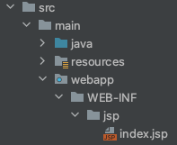

# spring jsp

## spring boot + jsp
개발환경
- spring boot 2.6.4
- Java 8
- Maven

pom.xml
```xml
<dependency>
  <groupId>org.springframework.boot</groupId>
  <artifactId>spring-boot-starter-web</artifactId>
</dependency>
<dependency>
  <groupId>org.springframework.boot</groupId>
  <artifactId>spring-boot-starter-tomcat</artifactId>
  <scope>provided</scope>
</dependency>
<dependency>
  <groupId>org.apache.tomcat.embed</groupId>
  <artifactId>tomcat-embed-jasper</artifactId>
  <scope>provided</scope>
</dependency>
<dependency>
  <groupId>javax.servlet</groupId>
 <artifactId>jstl</artifactId>
 <version>1.2</version>
</dependency>
<dependency>
<groupId>org.springframework.boot</groupId>
  <artifactId>spring-boot-devtools</artifactId>
  <scope>runtime</scope>
  <optional>true</optional>
</dependency>
```
Java Config
```java
@SpringBootApplication
public class SpringJspApplication extends SpringBootServletInitializer {

  public static void main(String[] args) {
    SpringApplication.run(SpringJspApplication.class, args);
  }

  @Override
  protected SpringApplicationBuilder configure(SpringApplicationBuilder application) {
    return application.sources(SpringJspApplication.class);
  }
}
```
application.yml
```yml
spring:
  mvc:
    view:
      prefix: /WEB-INF/jsp/
      suffix: .jsp
```
프로젝트 구조  


## JSP Error 처리
- BasicErrorController 에서 처리됨
- spring.mvc.view.prefix,suffix 에 error/{status} 에 있으면 처리됨 (JspTemplateAvailabilityProvider 참고)
  - ex) /WEB-INF/jsp/error/500.jsp, /WEB-INF/jsp/error/404.jsp
- 상단 프로퍼티 설정이 되지 않았을 경우 /WEB-INF/jsp/error.jsp

## 참고사항

> 만약 멀티 모듈 구성일 경우 인텔리제이 Edit Configuration 선택후  
> Working directory $MODULE_WORKING_DIR$ 추가 해야 jsp 파일 404 오류 발생하지 않음

> jsp 파일 변경시에 리로드 하지 않고 반영하기 위해선  
> spring-boot-devtools 의존성을 추가 할 경우 DevToolsPropertyDefaultsPostProcessor 에서  
> jsp 갱신과 관련된 프로퍼티 값을 추가해줌 또는 하단 프로퍼티 추가
```yml
server:
  servlet:
    jsp:
      init-parameters:
        development: true
```

## 참고사항 2

IntelliJ 에서 컨트롤러 리턴타입이 String 일 경우 해당 view 위치를 찾아주는데  
application.properties 일땐 정상 동작하지만 application.yml 로 만들면 위치를 못찾는다.

하단값을 읽어서 내부적으로 위치를 찾는걸로 보임.

```properties
spring.mvc.view.prefix=/WEB-INF/jsp/
spring.mvc.view.suffix=.jsp
```
