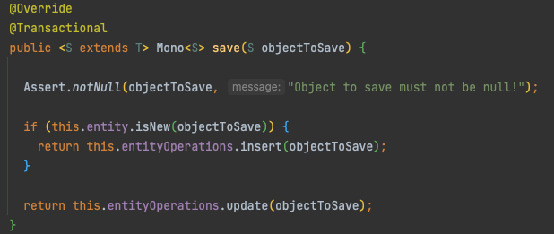
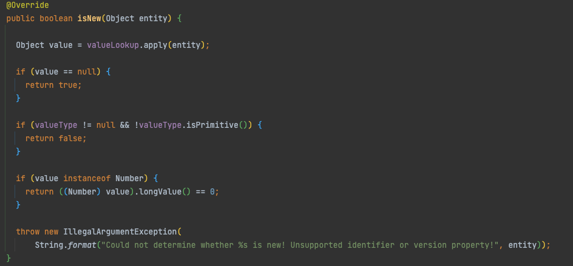
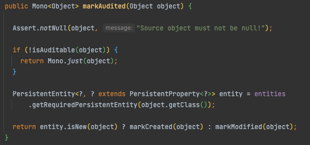

# Spring r2dbc

## 개발환경
- spring boot 2.6.3
- MariaDB 10.4.20

### pom.xml

```xml
<dependency>
  <groupId>org.springframework.boot</groupId>
  <artifactId>spring-boot-starter-webflux</artifactId>
</dependency>
<dependency>
  <groupId>org.springframework.boot</groupId>
  <artifactId>spring-boot-starter-data-r2dbc</artifactId>
</dependency>
<dependency>
  <groupId>org.mariadb</groupId>
  <artifactId>r2dbc-mariadb</artifactId>
  <scope>runtime</scope>
</dependency>
```

### application.yml

```yaml
spring:
  r2dbc:
    url: r2dbc:mariadb://127.0.0.1:3306/db_r2dbc
    username: root
    password: 111111

logging:
  level:
    "[org.springframework.r2dbc]": debug
```

## R2DBC 란?
Reactive Relational Database Connectivity 의 줄임말로서 관계형 데이터베이스 접근을 위한 리액티브 API 이다.  
즉, 적은수의 스레드로 동시성을 처리하며 적은 리소스로 확장가능한 not-blocking 스택이다.


## Troubleshooting

### 새로운 모델 저장시 이슈

R2DBC Repository 는 모델 저장시에 id 필드의 값이 있을 경우 Update 로 동작하여 해당 모델이 DB에 없을 경우 익셉션이 발생한다.



repository.save 호출시 새로운 객체일 경우에만 insert 를 호출 한다.

해당 대상이 `org.springframework.data.domain.Persistable` 를 구현 한 경우 이를 호출하여 판단하거나 

`org.springframework.data.mapping.model.PersistentEntityIsNewStrategy` 에서 아래와 같이 판단한다.



따라서 DB 에 Auto Increment 또는 Sequence 등을 세팅하지 않고 직접 할당 해야 할 경우에는 Persistable 구현후에    
id 필드가 null 일때 할당과 동시에 true 를 반환하면 된다.

```java
@org.springframework.data.relational.core.mapping.Table("mt_user")
@Data
public class User implements Persistable<String> {

  @Id
  private String id;

  private String name;

  private Integer age;

  @org.springframework.data.relational.core.mapping.Column("created_dt")
  @org.springframework.data.annotation.CreatedDate
  private LocalDateTime createdDt;

  @org.springframework.data.relational.core.mapping.Column("created_by")
  @org.springframework.data.annotation.CreatedBy
  private String createdBy;

  public static User create(String name, Integer age) {
    User user = new User();
    user.name = name;
    user.age = age;
    return user;
  }

  @Override
  @JsonIgnore
  public boolean isNew() {
    if (id == null) {
      id = UUID.randomUUID().toString();
      return true;
    }
    return false;
  }

}
```

#### 이슈 1

이 방법으로 하면 Model 에 @CreatedDate 를 추가하면 문제가 생긴다.  
`ReactiveIsNewAwareAuditingHandler` 에서 Auditing 수행할때도 isNew 를 호출한다.  
따라서 미리 isNew 가 호출되어 id 가 채워져있으면 무조건 Modified 로만 동작됨





## 참조
- [Spring-Data-r2dbc](https://docs.spring.io/spring-data/r2dbc/docs/current/reference/html)
- [Unblock Your Applications with R2DBC, Spring Data and MariaDB](https://mariadb.com/ko/resources/blog/unblock-your-applications-with-r2dbc-spring-data-and-mariadb/)
