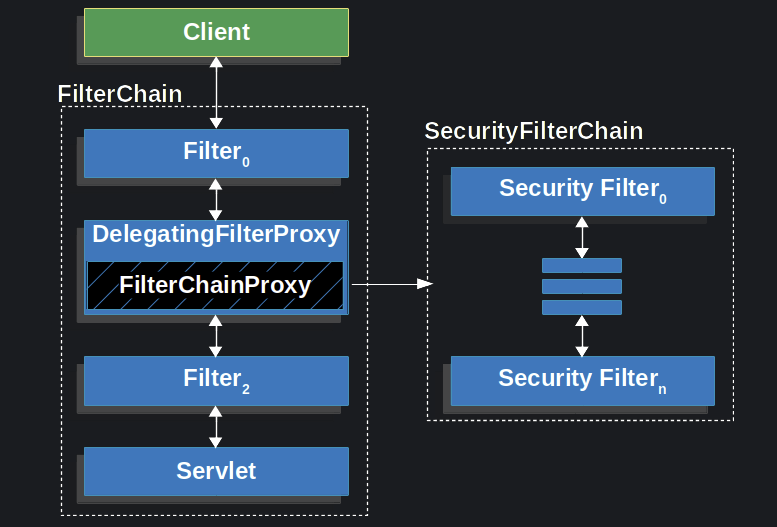

# Spring Security Core

## Settings
개발환경
- spring boot 2.6.4
- Java 8
- Maven

pom.xml
```xml
<dependency>
  <groupId>org.springframework.boot</groupId>
  <artifactId>spring-boot-starter-web</artifactId>
</dependency>
<dependency>
  <groupId>org.springframework.boot</groupId>
  <artifactId>spring-boot-starter-security</artifactId>
</dependency>
<dependency>
  <groupId>org.springframework.boot</groupId>
  <artifactId>spring-boot-starter-thymeleaf</artifactId>
</dependency>
<dependency>
  <groupId>org.thymeleaf.extras</groupId>
  <artifactId>thymeleaf-extras-springsecurity5</artifactId>
</dependency>
```

## [Spring Security Architecture](https://docs.spring.io/spring-security/reference/servlet/architecture.html)



- DelegatingFilterProxy
  - 특정 이름을 가진 bean 을 ApplicationContext 에서 찾아서 위임해준다.
  - `springSecurityFilterChain` 이라는 빈을 찾아 위임한다.
- FilterChainProxy
  - `List<SecurityFilterChain>` filterChains 목록을 관리하며 요청된 Request 를 처리 할 수 있는  
    RequestMatcher 를 가진 SecurityFilterChain 를 찾아서 처리를 위임한다.
  - 처리할수 있는 SecurityFilterChain 가 존재하면 VirtualFilterChain 으로 감싸서 doFilter 를 호출한다.
- SecurityFilterChain
  - Request 를 처리 할 수 있는 필터 체인을 관리한다. 
  - DefaultSecurityFilterChain 는 해당 요청에 적용되는지 여부를 결정하기 위해 RequestMatcher 를 가진다.

## Security Filters
Security Filter 추가 하는 경우에 순서가 중요하다.  
순서를 모두 알 필요는 없지만 중요한 몇가지에 대해선 알아두는것이 개발, 디버깅시에 편하다.

- ChannelProcessingFilter
- WebAsyncManagerIntegrationFilter
- SecurityContextPersistenceFilter
- HeaderWriterFilter
- CorsFilter
- CsrfFilter
- LogoutFilter
- OAuth2AuthorizationRequestRedirectFilter
- Saml2WebSsoAuthenticationRequestFilter
- X509AuthenticationFilter
- AbstractPreAuthenticatedProcessingFilter
- CasAuthenticationFilter
- OAuth2LoginAuthenticationFilter
- Saml2WebSsoAuthenticationFilter
- UsernamePasswordAuthenticationFilter
- OpenIDAuthenticationFilter
- DefaultLoginPageGeneratingFilter
- DefaultLogoutPageGeneratingFilter
- ConcurrentSessionFilter
- DigestAuthenticationFilter
- BearerTokenAuthenticationFilter
- BasicAuthenticationFilter
- RequestCacheAwareFilter
- SecurityContextHolderAwareRequestFilter
- JaasApiIntegrationFilter
- RememberMeAuthenticationFilter
- AnonymousAuthenticationFilter
- OAuth2AuthorizationCodeGrantFilter
- SessionManagementFilter
- ExceptionTranslationFilter
- FilterSecurityInterceptor
- SwitchUserFilter

## SessionManagementFilter, ConcurrentSessionFilter
동일 계정 로그인 중복 방지 기능 동작구조

- 로그인 처리시에 principal 을 Map 에 key 로 하고 SESSIONID 를 `Set<String>` 으로 저장한다.
- maxSessionsPreventsLogin(false) 일때 (이전 사용자 세션 만료 처리)  
  - maximumSessions 로 지정한 세션 수가 초과할 경우
  - 가장 오래된 유저 세션의 `SessionInformation.expireNow()` 를 호출한다.
- maxSessionsPreventsLogin(true) 일때 (신규 사용자 인증 실패 처리)
  - 현재 로그인하는 유저에 로그인 실패처리를 한다.

### 최대 세션 허용 개수 지정 방법
```java
protected void configure(HttpSecurity http) throws Exception {
  http.sessionManagement()
    .maximumSessions(1)
    .maxSessionsPreventsLogin(true)
    .invalidSessionUrl("/invalid") // 세션이 유효하지 않을 경우 이동 할 페이지
    .expiredUrl("expired") // 세션이 만료된 경우 이동 할 페이지
}
```

### HttpSessionEventPublisher
was 의 세션 관련 이벤트를 spring security 에서 처리 할 수 있도록 이벤트를 발생시킨다.  
> 리스너로 등록 하지 않을 경우 로그아웃 했을때 SessionRegistryImpl 의 principals, sessionIds 에서 삭제 되지 않아  
> 추후 로그인하는 유저의 로그인 처리가 안될수 있다.

리스너 Bean 등록
```java
@Bean
public ServletListenerRegistrationBean<HttpSessionEventPublisher> httpSessionEventPublisher() {
  return new ServletListenerRegistrationBean<>(new HttpSessionEventPublisher());
}
```

### SessionRegistry 의 구현체
- Spring Session 을 사용하지 않을 경우 : SessionRegistryImpl
- Spring Session 을 사용 할 경우 : SpringSessionBackedSessionRegistry
```java
public class SessionRegistryImpl implements SessionRegistry, ApplicationListener<AbstractSessionEvent> {
  //... 
  // <principal:Object,SessionIdSet>
  private final ConcurrentMap<Object, Set<String>> principals;

  // <sessionId:Object,SessionInformation>
  private final Map<String, SessionInformation> sessionIds;
  
  //...
  @Override
  public void onApplicationEvent(AbstractSessionEvent event) {
    if (event instanceof SessionDestroyedEvent) {
      SessionDestroyedEvent sessionDestroyedEvent = (SessionDestroyedEvent) event;
      String sessionId = sessionDestroyedEvent.getId();
      removeSessionInformation(sessionId);
    }
    else if (event instanceof SessionIdChangedEvent) {
      SessionIdChangedEvent sessionIdChangedEvent = (SessionIdChangedEvent) event;
      String oldSessionId = sessionIdChangedEvent.getOldSessionId();
      if (this.sessionIds.containsKey(oldSessionId)) {
        Object principal = this.sessionIds.get(oldSessionId).getPrincipal();
        removeSessionInformation(oldSessionId);
        registerNewSession(sessionIdChangedEvent.getNewSessionId(), principal);
      }
    }
  }
  //...
}
```

다른곳에서 `HttpSession.invalidate();` 메서드를 호출 할 경우 HttpSessionListener 의 `sessionDestroyed()` 가 호출 된다.

따라서 SessionRegistryImpl 의 onApplicationEvent 에서 처리되며
등록되어있는 Map 에서 해당 sessionId 를 제거한다.

```java
public class HttpSessionEventPublisher implements HttpSessionListener, HttpSessionIdListener {
  // ...
  @Override
  public void sessionDestroyed(HttpSessionEvent event) {
    extracted(event.getSession(), new HttpSessionDestroyedEvent(event.getSession()));
  }
  
  //...
  private void extracted(HttpSession session, ApplicationEvent e) {
    Log log = LogFactory.getLog(LOGGER_NAME);
    log.debug(LogMessage.format("Publishing event: %s", e));
    getContext(session.getServletContext()).publishEvent(e);
  }
}
```

## 참조
- [Spring, Security](https://docs.spring.io/spring-security/reference/index.html)
