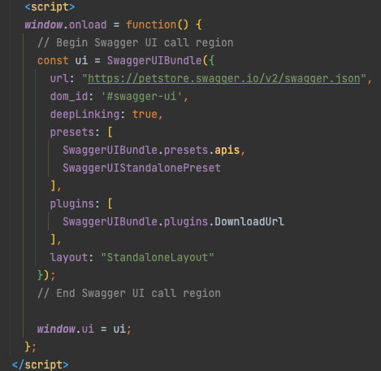
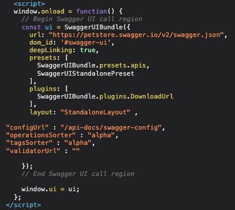
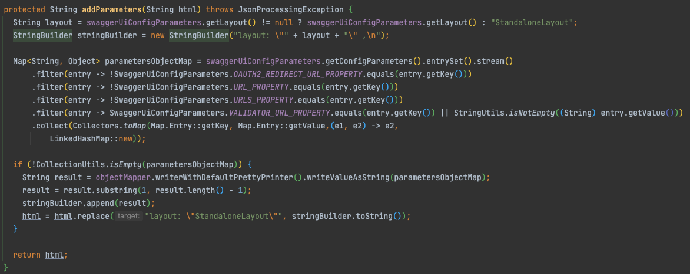
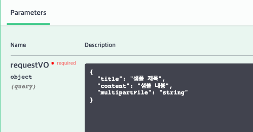
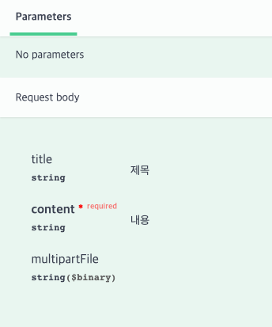

# spring - springdoc

## 개발환경
- spring boot 2.6.4
- Java 8
- Maven

## Springdoc 이란?
Annotation 기반으로 OpenAPI 3 Specification API 문서를 만들 수 있게 지원한다.    
또한 스프링 부트와의 통합하여 문서 생성 자동화에 도움을 준다.

지원 목록
- OpenAPI 3
- Spring Boot 1, Spring Boot 2
- JSR-303 (ex. @NotNull, @Min, @Max, @Size)
- Swagger-ui
- OAuth 2

## SpringFox vs Springdoc
SpringFox 2.9.2 가 2018.06 이후 업데이트가 끊긴 이후에 2020.06 부터 다시 시작됨  
2018.06 업데이트 끊긴 시점에 Springdoc 가 나타남 2019.07 부터 2022.01 까지 꾸준한 업데이트 지원

spring boot 2.6.x 부터 path matcher 처리 구현체가 AntPathMatcher 에서 PathPatternParser 로 변경 되고나서  
SpringFox 제일 최신버전(3.0.0)에서도 NPE로 인하여 서버 실행이 안됨.

해당 사항은 [Spring Boot v2.6 release note](https://github.com/spring-projects/spring-boot/wiki/Spring-Boot-2.6-Release-Notes) `PathPattern Based Path Matching Strategy for Spring MVC` 부분에도 나와있음

Springdoc 는 문제없이 실행되니 Springdoc 로 개발하는게 좋아보임 

swagger 개발 lib 
- SpringFox Swagger2 
  - latest : 3.0.0, 2020.07
- Springdoc 
  - latest: 1.6.4, 2022.01

## Swagger Annotations
| swagger 3 annotation                                                | swagger 2 annotation                        | description                            |
|---------------------------------------------------------------------|---------------------------------------------|----------------------------------------|
| @Tag                                                                | @Api                                        | 클래스를 Swagger 리소스로 표시                   |
| @Parameter(hidden = true), @Operation(hidden = true), @Hidden | @ApiIgnore                                  | API 문서 숨김 처리                           |
| @Parameter                                                          | @ApiImplicitParam                           | API 작업에서 단일 매개 변수를 나타냄                 | 
| @Parameters                                                         | @ApiImplicitParams                          | API 작업에서 복수 매개 변수를 나타냄                 |
| @Schema                                                             | @ApiModel                                   | Swagger 모델에 대한 추가 정보를 제공               |
| @Schema(accessMode = READ_ONLY)                                     | @ApiModelProperty(hidden = true)            | 모델 속성의 데이터가 요청시엔 없지만  응답시 추가될 수 있음 |
| @Schema                                                             | @ApiModelProperty                           | Swagger 모델에 대한 추가 정보를 제공               |
| @Operation(summary = "foo", description = "bar")                    | @ApiOperation(value = "foo", notes = "bar") | 특정 경로에 대한 작업 또는 일반적으로 HTTP 메서드를 설명     |
| @Parameter                                                          | @ApiParam                                   | 작업 매개 변수에 대한 추가 메타 데이터를 추가             |
| @ApiResponse(responseCode = "404", description = "foo")             | @ApiResponse(code = 404, message = "foo")   | 작업의 가능한 응답을 설명                         |

## Springdoc 의 Swagger-UI SearchBar url 변경 처리
springdoc 은 webjar 의 swagger-ui 를 사용하는데 Search Bar 의 데이터를 어떻게 바꿀수 있을까?

### ResourceTransformer
리소스 핸들러에 등록된 url 을 처리할때 HttpRequestHandlerAdapter 를 통해서  
ResourceHttpRequestHandler 가 사용된다.

이때 리소스를 가져와서 커스텀 할 수 있는 기능을 제공하는데 이를 처리하는 인터페이스가 ResourceTransformer 이다.

### SwaggerIndexPageTransformer
springdoc 에서는 SwaggerIndexPageTransformer 를 등록하는데  
swagger-ui 의 index 파일 요청일 경우 이를 webjars 에서 찾아온뒤
자바스크립트 호출 부분을 수정한다.

swagger-ui 스크립트 의 SwaggerUIBundle 객체 생성 부분에  
"configUrl" : "호출하려는 url" 부분을 추가하면 이를 읽어 화면을 렌더링한다.

#### before

#### after

#### SwaggerIndexPageTransformer 의 실제 replace 하는 method

## Troubleshooting

### swagger-ui multipart upload ui 잘못 나오는 이슈

/api-docs 에서 [requestBody 스펙](https://swagger.io/docs/specification/describing-request-body/) 을 잘못 내려주기 때문에 그렇다.  
springdoc 은 spring wec annotation 을 기반으로 swagger 스펙을 만들기 때문에 따로 지정을 해주어야 한다.

#### before

#### after

1. 하단과 같이 consumes 를 지정해야 한다.

`@PostMapping(value = "/multipart", consumes = MediaType.MULTIPART_FORM_DATA_VALUE)`

consumes 를 parsing 하는 부분 하단 메서드 확인

- MethodAttributes.calculateConsumesProduces

2. 컨트롤러 파라미터 앞에 어노테이션을 하나라도 붙혀야 한다.

`public String multipart(@Valid MultipartVO requestVO) { }`

> `AbstractRequestService.isRequestBodyParam()` 조건 확인

하단과 같이 swagger v3 annotation 을 사용해도 된다.

`@io.swagger.v3.oas.annotations.parameters.RequestBody(content = @Content(schema = @Schema(implementation = MultipartVO.class), mediaType = MediaType.MULTIPART_FORM_DATA_VALUE))`

## Authorization 헤더 추가

[oas3.0 에서는 헤더에 Accept, Content-Type, Authorization 헤더를 지정할 수 없다.](https://swagger.io/docs/specification/describing-parameters/#header-parameters)  
[따라서 인증, 인가 처리시 security scheme 을 통해 지정해야 한다.](https://swagger.io/docs/specification/authentication/)

- http
  - HTTP Authentications schema를 이용하는 방식
  - Authorization 헤더를 이용하는 방식
  - ex) Basic, Bearer 등...
- apiKey
  - API key 헤더를 이용한 인증
- oauth2
  - OAuth 2.0
- openIdConnect
  - OpenID Connect Discovery 이용

[How do I add authorization header in requests?](https://springdoc.org/#how-do-i-add-authorization-header-in-requests)

## 참조
- [swagger-ui, Configuration](https://swagger.io/docs/open-source-tools/swagger-ui/usage/configuration/)
- [springdoc](https://springdoc.org/)
- [Baeldung, springdoc](https://www.baeldung.com/spring-rest-openapi-documentation)
